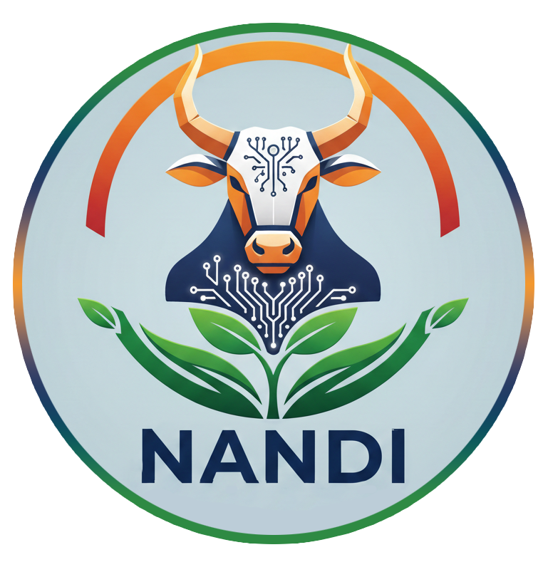
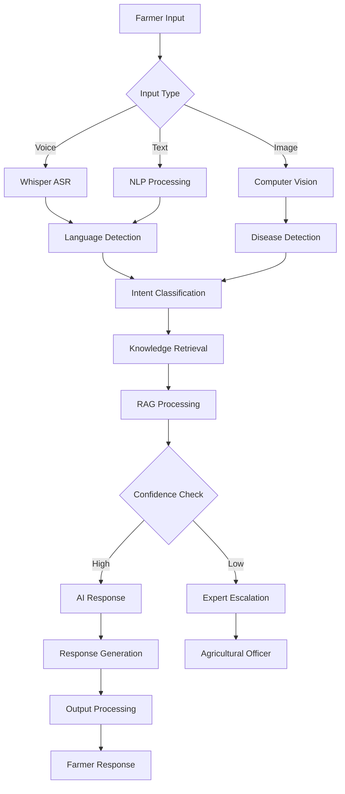

<div align="center">
  
</div>

# 🌾 NANDI - AI-Powered Digital Krishi Officer

<!-- [](https://opensource.org/licenses/MIT) -->
<!-- [](https://www.docker.com/) -->
<!-- [](https://kubernetes.io/) -->


[](https://www.python.org/)
[](https://fastapi.tiangolo.com/)
[](https://arxiv.org/abs/2005.11401)
[](https://nextjs.org/)
[](https://pytorch.org/)
[](https://huggingface.co/)
[](https://developer.nvidia.com/cuda-toolkit)
[](https://ai4bharat.org/)
[](https://github.com/justAbhinav/Nandi-System)
[](https://openai.com/)
[](https://github.com/justAbhinav/Nandi-System)

> **Democratizing agricultural expertise for India's 146 million farmers through AI-powered, multilingual advisory services**

## 🎯 Our Mission

NANDI transforms agricultural advisory services by creating an intelligent, multilingual AI system that provides instant, context-aware farming guidance. We bridge the critical gap where only 49% of farmers currently access technical advisory services, making expert-level farming advice accessible to all.

---

## ✨ Key Features

### 🗣️ **Multilingual Voice & Text Processing**

- Support for 12+ Indian languages including Hindi, Tamil, Telugu, Bengali, and more
- Fine-tuned Whisper models for accurate speech recognition
- Natural conversation flow in farmer's native language

### 📱 **Multimodal Intelligence**

- **Voice Queries**: "मेरी गेहूं की फसल में पीले धब्बे हैं, क्या करूं?"
- **Image Analysis**: Upload crop photos for disease detection (97.25% accuracy)
- **Text Chat**: Type questions in any supported language

### 🎯 **Context-Aware Recommendations**

- Location-based advice using GPS coordinates
- Crop-specific guidance based on farmer's cultivation
- Seasonal recommendations aligned with agricultural calendar
- Historical query understanding for personalized responses

### 🏥 **Smart Escalation System**

- Complex queries automatically routed to local agricultural officers
- Context and preliminary diagnostics shared with experts
- Seamless handoff with query history preservation

### 📈 **Continuous Learning**

- Real-time feedback integration
- Expert validation loops
- Self-improving AI models
- Community knowledge enhancement

---

## 🚀 Core Values

### **Accessibility First**

Every farmer, regardless of literacy level or smartphone access, deserves expert agricultural guidance.

### **Cultural Sensitivity**

Deep respect for local farming practices, integrating traditional wisdom with modern AI.

### **Privacy & Trust**

Farmer data protection with transparent, explainable AI recommendations.

### **Scalable Impact**

Building for millions - from individual farmers to entire agricultural communities.

---

## 🛠️ Technology Stack

### **Backend Architecture**

```
├── 🤖 AI/ML Layer
│   ├── RAG (Retrieval-Augmented Generation)
│   ├── Fine-tuned Whisper ASR
│   ├── AI4Bharat Language Models
│   └── Computer Vision (CNN-based)
│
├── 🌐 API Services
│   ├── FastAPI / Flask
│   ├── PostgreSQL / MongoDB
│   ├── Redis Caching
│   └── Celery Task Queue
│
└── ☁️ Infrastructure
    ├── Docker Containerization
    ├── Kubernetes Orchestration
    ├── AWS/GCP Cloud Services
    └── Edge Computing Support
```

### **Frontend Interfaces**

- **Mobile App**: React Native / Flutter
- **Web Dashboard**: React.js / Next.js
- **SMS Gateway**: Twilio / MSG91
- **WhatsApp Bot**: WhatsApp Business API

### **AI & ML Components**

- **Speech Recognition**: OpenAI Whisper (fine-tuned)
- **Language Models**: AI4Bharat IndicBERT, GPT-3.5/4
- **Computer Vision**: TensorFlow/PyTorch CNN models
- **Knowledge Retrieval**: FAISS Vector Database
- **Real-time APIs**: Weather, Market Prices, Government Schemes

---

## 📊 Impact Metrics

| Metric                 | Target             | Current Status |
| ---------------------- | ------------------ | -------------- |
| 👨‍🌾 Farmers Reached     | 10M+               | In Development |
| ⚡ Response Time       | <5 seconds         | Optimizing     |
| 🎯 Query Accuracy      | >95%               | Testing Phase  |
| 🌍 Languages Supported | 12+                | 5 Ready        |
| 💰 Cost Reduction      | 90% vs traditional | Projected      |

---

## 🏗️ System Architecture



---

## 🚦 Getting Started

### Prerequisites

- Python 3.9+
- Node.js 16+
- Docker & Docker Compose
- PostgreSQL
- Redis

### Quick Setup

```bash
# Clone the repository
git clone https://github.com/justAbhinav/Nandi-System.git
cd Nandi-System

# Set up backend
cd backend
pip install -r requirements.txt
python manage.py migrate
python manage.py runserver

# Set up frontend
cd ../frontend
npm install
npm start

# Run with Docker
docker-compose up -d
```

### Configuration

```bash
# Environment Variables
cp .env.example .env

# Required API Keys
OPENAI_API_KEY=your_openai_key
WHISPER_MODEL_PATH=path_to_fine_tuned_model
WEATHER_API_KEY=your_weather_api_key
SMS_GATEWAY_KEY=your_sms_key
```

---

## 📱 Usage Examples

### Voice Query (Hindi)

```
🎤 "मेरे टमाटर के पौधे में कीड़े लग गए हैं। कौन सी दवा डालूं?"

🤖 "आपके टमाटर में फल छेदक कीट लगा है। इमामेक्टिन बेंजोएट
    5% SG @ 0.4 ग्राम प्रति लीटर पानी में मिलाकर छिड़काव करें।"
```

### Image Analysis

```
📷 [Farmer uploads crop disease image]

🤖 "Detected: Tomato Late Blight
    Confidence: 96.8%
    Treatment: Apply Metalaxyl + Mancozeb fungicide
    Prevention: Improve drainage, avoid overhead watering"
```

---

## 🤝 Contributing

Currently we are not open for contirbutions, The Idea is still in its ideation phase.

<!-- ### Development
1. Fork the repository
2. Create feature branch (`git checkout -b feature/AmazingFeature`)
3. Commit changes (`git commit -m 'Add AmazingFeature'`)
4. Push to branch (`git push origin feature/AmazingFeature`)
5. Open a Pull Request -->

### Agricultural Content

- Submit crop-specific knowledge
- Share local farming practices
- Contribute to multilingual datasets
- Validate AI recommendations

---

## 📚 Documentation

- [API Documentation](docs/API.md)
- [Model Training Guide](docs/TRAINING.md)
- [Deployment Instructions](docs/DEPLOYMENT.md)
- [Contributing Guidelines](CONTRIBUTING.md)

---

## 🎯 Roadmap

### Phase 1

- [ ] Core RAG system deployment
- [ ] 5 Indian languages support
- [ ] Basic crop disease detection
- [ ] SMS/WhatsApp integration

### Phase 2

- [ ] 12+ language support
- [ ] Advanced computer vision
- [ ] Mobile app launch
- [ ] Government scheme integration

### Phase 3

- [ ] Livestock advisory
- [ ] Market price predictions
- [ ] Satellite integration
- [ ] 10M farmer milestone

---

<!-- ## 🏆 Recognition
 -->

---

## 📄 License

This project is licensed under the MIT License - see the [LICENSE](LICENSE) file for details.

---

## 👥 Team

**Core Development Team**

- **Abhinav Singh (Team Leader)** - AI & ML Engineer
- **Lakshya Rawat** - Backend Developer
- **Jyoti Kumari** - Cybersecurity Engineer
- **Sanskriti Arora** - Frontend Developer
- **Aditya Narula** - UI/UX Developer
- **Karun Pacholi** - Blockchain & Web3 Developer

---

## 📞 Contact & Support

- 📧 Email: 22ucs004@lnmiit.ac.in
- 🌐 Website: [nandi-farming-copilot.vercel.app](https://nandi-farming-copilot.vercel.app/)
  <!-- - 📱 WhatsApp: +91-XXXXX-XXXXX -->
  <!-- - 🐦 Twitter: [@NandiAgri](https://twitter.com/NandiAgri) -->

---

<!-- ## 🙏 Acknowledgments

- **AI4Bharat** for Indic language models and datasets
- **OpenAI** for Whisper speech recognition technology
- **Indian Agricultural Research Institute** for domain expertise
- **Smart India Hackathon** for platform and support
- **Farming communities** for continuous feedback and validation -->

---

<div align="center">

### 🌱 _Empowering Every Farmer, One Query at a Time_ 🌱

**Made with ❤️ for India's farming community**

[](https://github.com/justAbhinav/Nandi-System/stargazers)
[](https://github.com/justAbhinav)

</div>
